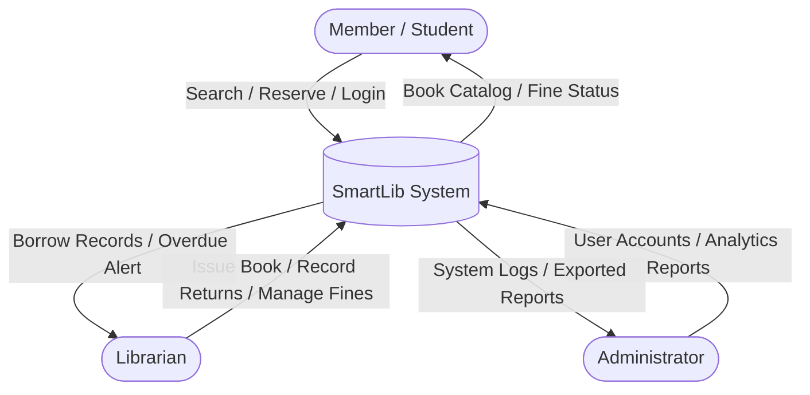

# SmartLib System Analysis & Design Document

**Course**: Systems Analysis and Design  
**Project**: SmartLib Automated Library System  
**Deliverable**: Comprehensive Software Requirements Specification (SRS) & System Design Document (SDD)

---

## 1. Introduction & Problem Statement

### 1.1 Project Overview
SmartLib is a modern, full-stack digital solution designed to replace manual library processes. In traditional configurations, processes such as inventory tracking, student borrowings, and fine calculations are handled manually via paper logs and registers. SmartLib automates these workflows, delivering a web application accessible by Administrators, Librarians, and Members (Students/Staff).

### 1.2 Identified Problems with Manual Operations
- **Data Integrity Risks**: Book inventory and member records on paper registers are susceptible to physical damage, degradation, and loss.
- **Access Bottlenecks**: Members cannot verify book availability without physical visitation.
- **Inaccurate Accounting**: Manual calculation of late return fines is error-prone, inconsistent, and administratively slow.
- **Reporting Stagnation**: Consolidating performance logs, popular catalog categories, and fine tallies into monthly reports is labor-intensive.
- **Lack of Reservation Controls**: Members have no facility to queue or reserve high-demand textbooks in advance.

---

## 2. Feasibility Study

An initial feasibility evaluation was conducted to assess technical capability, financial constraints, operational readiness, time variables, and compliance:

| Area | Assessment Details | Verdict |
| :--- | :--- | :--- |
| **Technical** | Built using industry-standard tools (Node.js, Express.js, and SQLite3 database engine). The architecture uses lightweight RESTful patterns requiring standard browser execution. | **Feasible** |
| **Economic** | Developed using open-source, license-free packages. Local database execution (SQLite3) eliminates expensive cloud hosting databases, keeping deployment costs at zero. | **Feasible** |
| **Operational** | Clean, intuitive dashboard interface with custom themes. Self-explanatory controls require less than 30 minutes of user training. | **Feasible** |
| **Time** | Structured using an Agile iterative approach. Core services (Book cataloging, borrowing engine, fine automation, reports) can be built within a single academic semester. | **Feasible** |
| **Legal** | The platform stores only non-sensitive institutional library data (Title, Author, ISBN, and student institutional emails). Compliance is ensured with no copyright or GDPR violations. | **Feasible** |

---

## 3. Requirements Specification

### 3.1 Functional Requirements (FR)
1. **User Authentication**:
   - Users must authenticate using a unique username and password.
   - The system must assign a specific role (`admin`, `librarian`, `member`) to control navigation panels and route access.
2. **Catalog & Search**:
   - Librarians must be able to create, edit, and delete catalog books.
   - All users must be able to search the catalog in real-time by title, author, genre, or ISBN.
3. **Borrowing Transaction Engine**:
   - The system must log every borrow checkout event, recording the member ID, book ID, borrow date, and due date.
   - The system must automatically decrement available copies upon checkout and increment them upon return.
4. **Reservation Workflow**:
   - Members must be able to reserve a book in advance (adding to a pending waitlist queue).
   - Librarians can view the reservation queue to fulfill checkouts immediately once copies are returned.
5. **Fine Management Automation**:
   - The system must automatically flag overdue checkouts.
   - Late return fines must be auto-calculated at a rate of $1.00 per day.
   - Librarians must be able to record fine payments.
6. **Reporting & Analytics**:
   - Administrators and Librarians must be able to view dynamic library statistics (Total Books, Active Borrowings, Fines Collected).
   - The system must generate visual activity trends and checkout charts.
   - Users must be able to export library borrowing activity records to CSV or JSON formats.

### 3.2 Non-Functional Requirements (NFR)
- **Performance**: High search efficiency and page renders loading within 3 seconds.
- **Security**: Hardened REST endpoints verifying token authorizations to block unauthorized role operations.
- **User Experience (UX)**: A responsive workspace supporting dark/light UI transitions.
- **Reliability**: A server design targeting 99% availability during operating hours.

---

## 4. System Architecture & Diagrams

### 4.1 System Context Diagram (DFD Level 0)
The diagram below shows the high-level boundary of the SmartLib system and its interactions with external entities.



### 4.2 Entity-Relationship Diagram (ERD)
The SQLite relational schema models users, books, checkout logs, reservations, fines, and student roster matches.

```mermaid
erDiagram
    USERS {
        INTEGER id PK
        TEXT username UNIQUE
        TEXT password
        TEXT role
        TEXT name
        TEXT email
        INTEGER is_verified
        TEXT verification_token
        TEXT student_id
        TEXT index_number
        TEXT reset_token
        TEXT reset_token_expiry
    }
    BOOKS {
        INTEGER id PK
        TEXT title
        TEXT author
        TEXT genre
        TEXT isbn UNIQUE
        INTEGER total_copies
        INTEGER available_copies
    }
    BORROWINGS {
        INTEGER id PK
        INTEGER book_id FK
        INTEGER member_id FK
        TEXT borrow_date
        TEXT due_date
        TEXT return_date
        TEXT status
    }
    RESERVATIONS {
        INTEGER id PK
        INTEGER book_id FK
        INTEGER member_id FK
        TEXT reservation_date
        TEXT status
    }
    FINES {
        INTEGER id PK
        INTEGER borrowing_id FK
        REAL amount
        TEXT status
        TEXT payment_date
    }
    STUDENT_ROSTER {
        INTEGER id PK
        TEXT name
        TEXT student_id UNIQUE
        TEXT index_number UNIQUE
    }
    SITE_VISITS {
        INTEGER id PK
        TEXT visit_time
    }

    USERS ||--o{ BORROWINGS : "places"
    USERS ||--o{ RESERVATIONS : "requests"
    BOOKS ||--o{ BORROWINGS : "lent_in"
    BOOKS ||--o{ RESERVATIONS : "reserved_in"
    BORROWINGS ||--o| FINES : "generates"
    STUDENT_ROSTER ||--o| USERS : "verifies"
```

---

## 5. Interface & API Specifications

The application uses standard REST APIs to interface between client views and the SQLite database.

| Method | Endpoint | Description | Permitted Roles |
| :--- | :--- | :--- | :--- |
| **POST** | `/api/auth/verify-roster` | Match Student ID and Index Number against master roster | All |
| **POST** | `/api/auth/register` | Register a new user profile & triggers activation email | All |
| **POST** | `/api/auth/login` | Authenticate credentials & reject unverified accounts | All |
| **GET** | `/api/auth/verify` | Verify token and activate user account | All |
| **POST** | `/api/auth/forgot-password` | Generate reset token and email password recovery link | All |
| **POST** | `/api/auth/verify-reset-token` | Confirm validity of email recovery token | All |
| **POST** | `/api/auth/reset-password` | Set new password and clean recovery token fields | All |
| **GET** | `/api/books` | Search catalog with title/author/ISBN filtering | All |
| **POST** | `/api/books` | Add a new book to inventory | Admin, Librarian |
| **PUT** | `/api/books/:id` | Update copies count or metadata of a book | Admin, Librarian |
| **DELETE** | `/api/books/:id` | Remove a book from the catalog | Admin, Librarian |
| **POST** | `/api/borrowings` | Issue a book checkout | Admin, Librarian |
| **POST** | `/api/borrowings/:id/return` | Process return & calculate outstanding fines | Admin, Librarian |
| **GET** | `/api/reservations` | Retrieve book reservation waitlists | All (Self only for Member) |
| **POST** | `/api/reservations` | Request a book reservation | Member |
| **POST** | `/api/fines/:id/pay` | Record a collected fine payment | Admin, Librarian |
| **GET** | `/api/reports/dashboard` | Generate analytics and metrics dataset | Admin, Librarian |
