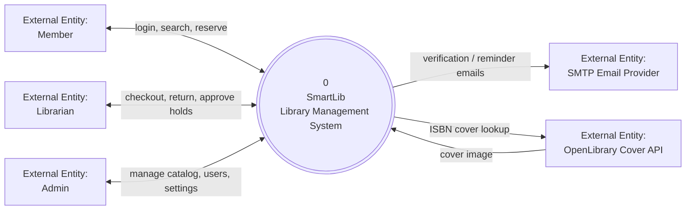
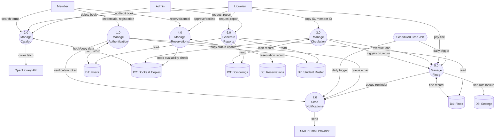

# Data Flow Diagram — SmartLib

Two levels, following standard DFD convention: rectangles are external
entities, rounded shapes are processes, cylinders are data stores.

## Level 0 — Context Diagram

## Level 1 — Major Processes

## Notes

- **Process 7.0 (Send Notifications)** is fed by two sources: account
  verification (from 1.0, on register) and fine/reminder emails (from 5.0,
  triggered daily by the cron job in `src/services/cron.service.ts`) — this
  reflects the actual notification feature added this session
  (`EmailService.queueDueSoonReminder` / `queueOverdueReminder`).
- **Process 3.0 (Manage Circulation)** feeding into **5.0 (Manage Fines)**
  reflects that returning an overdue book calculates a fine synchronously
  (`CirculationService.returnBook`), separately from the daily cron batch
  that updates fines for books still out.
- Data store reads for 6.0 (Reports) are read-only — reports never write
  back to D1/D3/D4/D7, matching `src/controllers/reports.controller.ts`.
