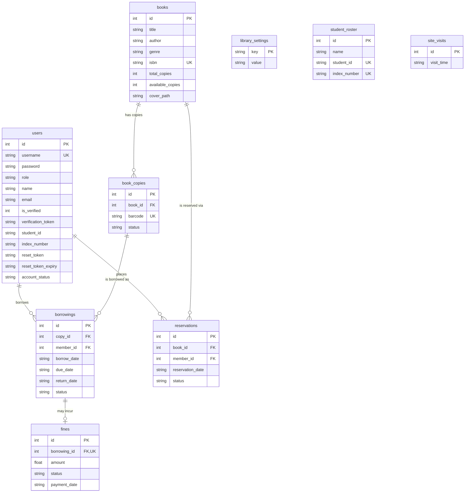

# Entity-Relationship Diagram — SmartLib

Generated directly from `prisma/schema.prisma` (the real, current schema — not
a design sketch). Renders natively on GitHub; paste into any Mermaid-aware
tool (draw.io import, Mermaid Live Editor) to export as PNG/SVG for a report
or slide deck.

## Notes on the actual schema (not idealized)

- **`library_settings`, `student_roster`, and `site_visits` have no foreign
  keys** — they're independent lookup/log tables, not connected to the rest
  of the model. `student_roster` is used only during registration to verify
  a claimed Student ID + Index Number pair; it isn't linked to `users` by a
  foreign key, only compared at application level in
  `src/services/user.service.ts`.
- **`fines` is 1:0..1 with `borrowings`** (a `@unique` on `borrowing_id`) —
  a borrowing can have at most one fine record, which is upserted (not
  duplicated) as days-overdue accrues.
- **Normalization**: all tables are in 3NF — every non-key attribute depends
  on the whole primary key and nothing but the key (e.g. `available_copies`
  on `books` is a derived/cached count rather than being computed by
  counting `book_copies` per request, which is a deliberate
  denormalization for read performance, not a normalization violation of
  the schema itself).
