# Use Case Diagram — SmartLib

Built directly from the real route table (`src/routes/*.ts`), not a design
guess — every use case below maps to an endpoint that actually exists and
enforces the stated role via `authenticate`/`authorize` middleware. Mermaid
has no native UML use-case shape, so this is drawn as a flowchart with actors
on the outside and use cases grouped inside the system boundary, which is the
standard workaround and still reads as a proper use-case diagram.

```mermaid
flowchart LR
    Guest(["Guest\n(unauthenticated)"])
    Member(["Member"])
    Librarian(["Librarian"])
    Admin(["Admin"])
    Cron(["System\n(scheduled jobs)"])

    subgraph SmartLib["SmartLib System"]
        direction TB
        UC1(("Register Account"))
        UC2(("Verify Email"))
        UC3(("Login / Logout"))
        UC4(("Reset Password"))
        UC5(("Browse / Search Catalog"))
        UC6(("View Book Detail"))
        UC7(("Reserve Book"))
        UC8(("Cancel Reservation"))
        UC9(("View Own Loan History"))
        UC10(("Check Out Book"))
        UC11(("Return Book"))
        UC12(("Approve / Decline Reservation"))
        UC13(("View & Pay Fines"))
        UC14(("Add / Edit Book"))
        UC15(("Add Book Copy"))
        UC16(("View Circulation Report"))
        UC17(("View Blocked-Members Report"))
        UC18(("Delete Book"))
        UC19(("Delete User"))
        UC20(("Manage System Settings"))
        UC21(("View Roster Audit Report"))
        UC22(("View All Users"))
        UC23(("Calculate Overdue Fines"))
        UC24(("Send Due-Soon Reminder"))
        UC25(("Send Overdue Reminder"))
        UC26(("Send Verification Email"))
    end

    Guest --> UC1
    Guest --> UC2
    Guest --> UC3
    Guest --> UC4
    Guest --> UC5
    Guest --> UC6

    Member --> UC3
    Member --> UC5
    Member --> UC6
    Member --> UC7
    Member --> UC8
    Member --> UC9

    Librarian --> UC3
    Librarian --> UC10
    Librarian --> UC11
    Librarian --> UC12
    Librarian --> UC13
    Librarian --> UC14
    Librarian --> UC15
    Librarian --> UC16
    Librarian --> UC17

    Admin --> UC10
    Admin --> UC11
    Admin --> UC12
    Admin --> UC14
    Admin --> UC18
    Admin --> UC19
    Admin --> UC20
    Admin --> UC21
    Admin --> UC22

    Cron --> UC23
    Cron --> UC24
    Cron --> UC25
    UC1 -.triggers.-> UC26
```

## Known gaps (deliberately shown, not hidden)

- **"View My Loans" / "View My Fines" for Member** — `GET /borrowings` and
  `GET /fines` are now member-scoped (a member sees only their own
  records), so this gap is closed. `UC9` in the diagram above reflects
  this.
- **No "View My Reservations" for Member** — `GET /reservations` exists
  and is member-scoped-capable in principle, but currently only returns
  the full staff-wide list; a member calling it would see everyone's
  holds, not just their own. Still flagged in the UI
  (`client/src/app/(member)/loans/page.tsx`) rather than hidden.
- **"Manage Members"** (edit a member's profile, not just delete) has no
  endpoint — only `GET /users`, `GET /users/:id/history`, and
  `DELETE /users/:id` exist.
